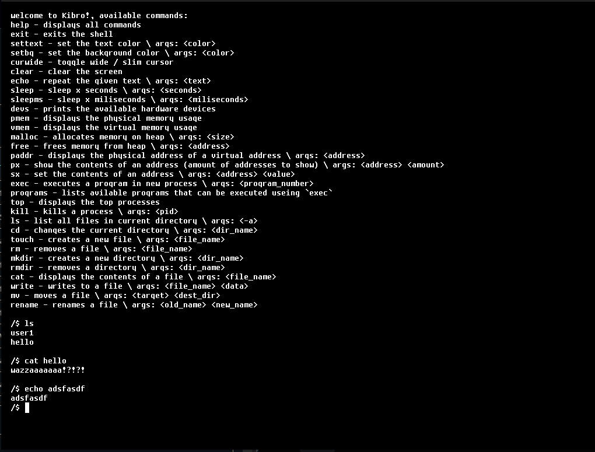

# Kibro

a simple 32-bit x86 operating system made from scratch by matan and yonatan
the os has the basic functionality and core components of an os:

- drivers for keyboard, screen and disk
- memory management
- process managment
- file system
- shell with basic commands
- and some more features

## requirements

- **docker** (for compiling and building)
- **qemu** (or any other vm manager)

## build docker image

the docker image is used for compiling the os, it ensures the correct compilation environment is always used

`docker build <WORKING_DIR> -t os-buildenv`

(usualy the working dir is './' for current direcotory)

## compile and run using script

### windows

`.\run.bat`  
*windows script does not have debug and clean options 

### linux

`./run.sh`

## example output

